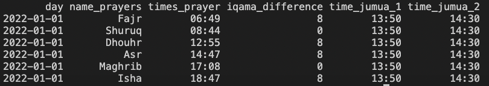

# Context

As a Muslim, it is obligatory to pray 5 times a day in different prayers at specific times:

- Fajr
- Dhur
- Asr
- Mahgreb
- Isha

as well as performing the Friday group prayer (Jumua) at the mosque.

To know the time of the prayers two solutions were offered to me:

- there are many applications on Google Store/Apple Store. Not wanting my personal data to be used by third party applications, I decided not to use them anymore.
- to go through websites, multiply the tabs within my smartphone and have to do the google search every time. This solution is boring.

I decided to do this project to facilitate the daily life of people living in the Paris region and referring to the Paris mosque.

By using telegram, you will receive a daily message with all the following information:

- exact times of the 5 obligatory prayers
- exact times of the 2 Friday prayer slots
- iqama times : how many minutes between adhan (the call to prayer by the Imam and the beginning of the prayer)
- shuruq: extra prayer in the morning after Fajr prayer (but highly recommended)

# Technical Overview

## Workflow

## Data Modelling (sample)

