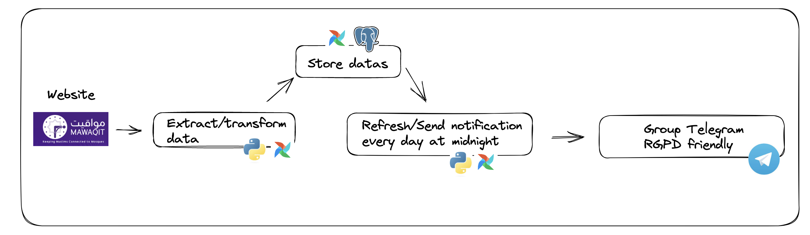

# Context

As a Muslim, it is obligatory to pray 5 times a day in different prayers at specific times:

- Fajr
- Dhouhr
- Asr
- Mahgrib
- Isha


as well as performing the Friday group prayer (Jumua) at the mosque every week.

To know the starting time of prayer, I had two solutions :

- there are many applications on Google Store/Apple Store. However, some of these applications had wrong prayer times, and I didn't want my data leaked by something other than third-party applications, so I decided not to use them anymore.
- to go through websites, multiply the tabs within my smartphone and have to do the google search every time. This solution is boring.

I discovered the [Mawaqit association](https://mawaqit.net/fr/). This association aims to provide users with quality information through a website/app.

As an avid telegram user, I decided to do this project to access this quality information and condense it within a telegram (RGPD-friendly) group.
This solution will facilitate the daily life of people (telegram fans like me) living in the Paris area and referring to the Paris mosque.

You will receive a daily message using my telegram bot with all the following information.

- the exact times of the five obligatory prayers
- exact times of the 2 Friday prayer slots (first session: time_jumua_1 and second session: time_jumua_2)
- iqama time (iqama_difference >= 0): how many minutes between the adhan (the call to prayer by the Imam and the beginning of the prayer)
- shuruq : additional prayer in the morning after the Fajr prayer (but highly recommended)
- different duas in French and Arabic (when arriving at the mosque, after the adhan ..)

# Technical Overview

## Workflow



## Data Modelling


- day and name_prayers are the IDs columns


# Setup local

```
git clone -b enonce https://github.com/MohamedBsh/an-humble-suggestion-of-a-telegram-bot-from-the-mawaqit-app-prayers-times.git

pipenv install
pipenv shell

sudo chmod +x ./install.sh
source ./install.sh

airflow standalone
```

UI Airflow : [localhost:8080](localhost:8080)

If needed, in `airflow/airflow.cfg` modify :

```
load_examples = False
```

# Setup a database

- Install a local postgres instance(for macos): https://www.postgresql.org/download/macosx/

- You can install a software allowing to visualize / query the data in a database (e.g DBeaver, Datagrip, pgadmin ..)

- Create a database, and a username/password

- GRANT ALL ON schema public TO username;

```
Create .env file :
export DB_HOST=XXX
export DB_PORT=XXX
export DB_NAME=XXX
export DB_USER=XXX
export DB_PASSWORD=XXX 
```

# Airflow variables

In UI Airflow, you can create Variables in Admin > Variables. 
We use it for our scheduled_telegram_notification_midnight dag.
Create two Variables 'TELEGRAM_BOT_TOKEN' and 'TELEGRAM_CHAT_ID'.

To get this information, download Telegram and chat with 'BotFather' to create the bot.